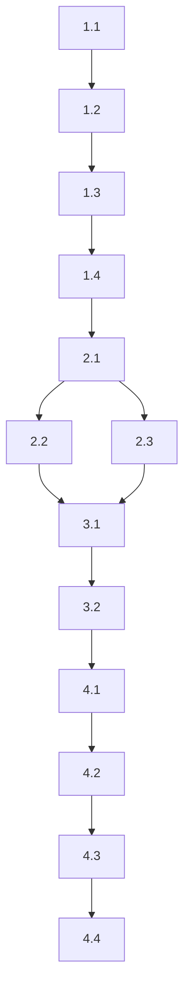

# Tasks: sample-feature

> Generated by CEO Ralph on 2026-01-18

## Overview

**Total Tasks**: 11
**Estimated Time**: 2-3 hours
**Parallelizable**: 2 tasks

## Phase 1: Make It Work (POC)

- [ ] 1.1 Create CSS theme variables
  - **Do**: Create theme.css with CSS custom properties for light and dark themes
  - **Files**: src/styles/theme.css
  - **Context**: See design.md TD-1
  - **Acceptance**:
    - [ ] Light theme variables defined in :root
    - [ ] Dark theme variables defined in [data-theme="dark"]
    - [ ] Variables include: --bg, --text, --primary, --border
  - **Done when**: Both themes have complete variable sets
  - **Verify**: File exists and contains both theme definitions
  - **Commit**: `feat(theme): add CSS custom properties for themes`
  - **Worker**: codex
  - _Requirements: FR-4_
  - _Design: theme.css_

- [ ] 1.2 Create ThemeContext
  - **Do**: Create ThemeContext with provider and useTheme hook
  - **Files**: src/contexts/ThemeContext.tsx
  - **Context**: See design.md Component: ThemeProvider
  - **Acceptance**:
    - [ ] ThemeContext created with theme and toggleTheme
    - [ ] ThemeProvider component manages state
    - [ ] useTheme hook exported
    - [ ] Theme applied to document.documentElement
  - **Done when**: Context can be imported and used
  - **Verify**: TypeScript compiles without errors
  - **Commit**: `feat(theme): add ThemeContext and provider`
  - **Worker**: codex
  - _Requirements: FR-2, FR-3_
  - _Design: ThemeProvider_

- [ ] 1.3 Create ThemeToggle component
  - **Do**: Create toggle button that uses useTheme
  - **Files**: src/components/ThemeToggle.tsx
  - **Context**: See design.md Component: ThemeToggle
  - **Acceptance**:
    - [ ] Button renders with sun/moon icon based on theme
    - [ ] Click calls toggleTheme
    - [ ] Accessible with keyboard and ARIA label
  - **Done when**: Toggle switches theme when clicked
  - **Verify**: Component renders without errors
  - **Commit**: `feat(theme): add ThemeToggle component`
  - **Worker**: codex
  - _Requirements: FR-1_
  - _Design: ThemeToggle_

- [ ] 1.4 [VERIFY] POC Quality Checkpoint
  - **Do**: Verify theme system works end-to-end
  - **Verify**: `npm run build`
  - **Worker**: ceo
  - **Done when**: Build succeeds, no TypeScript errors

## Phase 2: Refactoring

- [ ] 2.1 Add localStorage persistence
  - **Do**: Add localStorage read/write to ThemeContext
  - **Files**: src/contexts/ThemeContext.tsx
  - **Acceptance**:
    - [ ] Theme saved to localStorage on change
    - [ ] Theme restored from localStorage on load
    - [ ] Handles missing/invalid localStorage gracefully
  - **Done when**: Theme persists across page reloads
  - **Verify**: Manual test of persistence
  - **Commit**: `feat(theme): add localStorage persistence`
  - **Worker**: codex
  - _Requirements: FR-2_

- [ ] 2.2 [P] Add system preference detection
  - **Do**: Detect prefers-color-scheme and use as default
  - **Files**: src/contexts/ThemeContext.tsx
  - **Acceptance**:
    - [ ] Detects system preference on first load
    - [ ] User preference overrides system preference
    - [ ] Listens for system preference changes
  - **Done when**: System preference used when no localStorage
  - **Verify**: Works with browser dev tools emulation
  - **Commit**: `feat(theme): add system preference detection`
  - **Worker**: codex
  - _Requirements: FR-3_

- [ ] 2.3 [P] Add CSS transitions
  - **Do**: Add smooth transitions for theme changes
  - **Files**: src/styles/theme.css
  - **Acceptance**:
    - [ ] Colors transition over 200-300ms
    - [ ] Transition applies to background, color, border
    - [ ] No layout shift during transition
  - **Done when**: Theme changes feel smooth
  - **Verify**: Visual inspection
  - **Commit**: `feat(theme): add smooth transitions`
  - **Worker**: codex
  - _Requirements: FR-4_

## Phase 3: Testing

- [ ] 3.1 Add unit tests for ThemeContext
  - **Do**: Write tests for ThemeProvider and useTheme
  - **Files**: src/contexts/ThemeContext.test.tsx
  - **Acceptance**:
    - [ ] Test default theme initialization
    - [ ] Test toggleTheme functionality
    - [ ] Test localStorage integration
  - **Done when**: All tests pass
  - **Verify**: `npm test ThemeContext`
  - **Commit**: `test(theme): add ThemeContext tests`
  - **Worker**: codex
  - _Requirements: All_

- [ ] 3.2 Add unit tests for ThemeToggle
  - **Do**: Write tests for ThemeToggle component
  - **Files**: src/components/ThemeToggle.test.tsx
  - **Acceptance**:
    - [ ] Test render with light theme
    - [ ] Test render with dark theme
    - [ ] Test click handler
  - **Done when**: All tests pass
  - **Verify**: `npm test ThemeToggle`
  - **Commit**: `test(theme): add ThemeToggle tests`
  - **Worker**: codex
  - _Requirements: FR-1_

## Phase 4: Quality Gates

- [ ] 4.1 [VERIFY] Lint Check
  - **Do**: Run lint and fix any issues
  - **Verify**: `npm run lint`
  - **Worker**: ceo
  - **Done when**: Lint passes with no errors

- [ ] 4.2 [VERIFY] Type Check
  - **Do**: Verify all TypeScript types
  - **Verify**: `npm run check-types`
  - **Worker**: ceo
  - **Done when**: No type errors

- [ ] 4.3 [VERIFY] All Tests Pass
  - **Do**: Run full test suite
  - **Verify**: `npm test`
  - **Worker**: ceo
  - **Done when**: All tests pass

- [ ] 4.4 [VERIFY] [CRITICAL] Final Build
  - **Do**: Verify production build succeeds
  - **Verify**: `npm run build`
  - **Worker**: ceo
  - **Done when**: Build completes successfully

## Task Dependencies

## Requirements Coverage

| Requirement | Tasks |
|-------------|-------|
| FR-1 | 1.3, 3.2 |
| FR-2 | 1.2, 2.1, 3.1 |
| FR-3 | 1.2, 2.2, 3.1 |
| FR-4 | 1.1, 2.3 |

## Notes for Execution

- Tasks 2.2 and 2.3 can run in parallel (marked [P])
- POC checkpoint at 1.4 verifies basic functionality before refinement
- All quality gates must pass before completion
